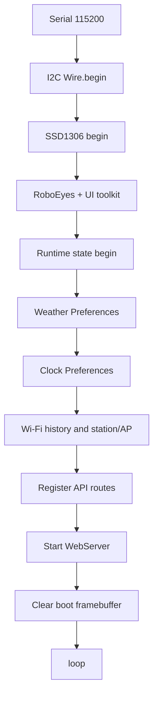
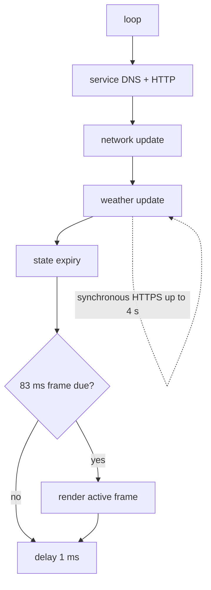
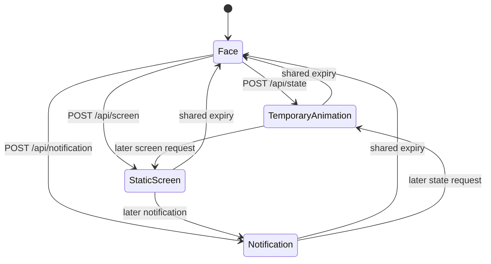
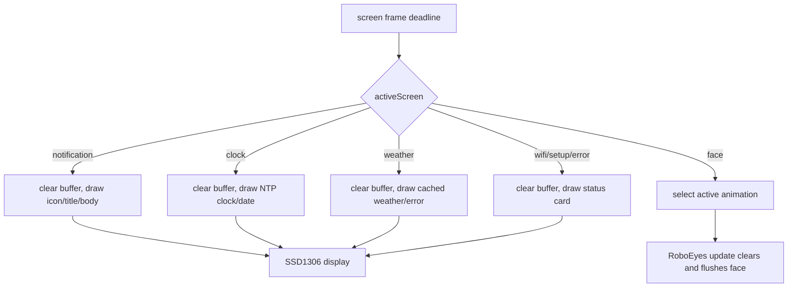
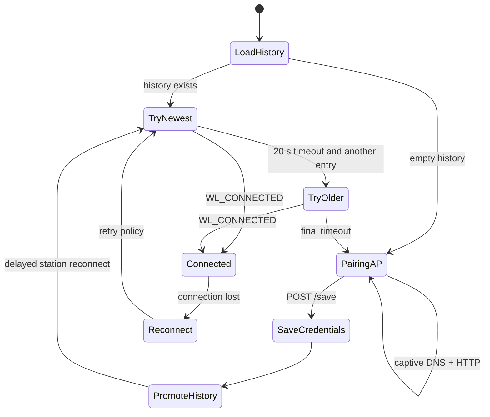
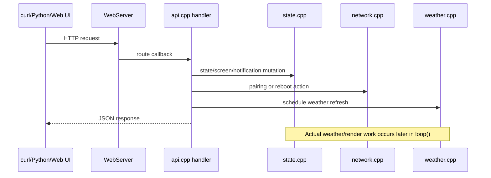
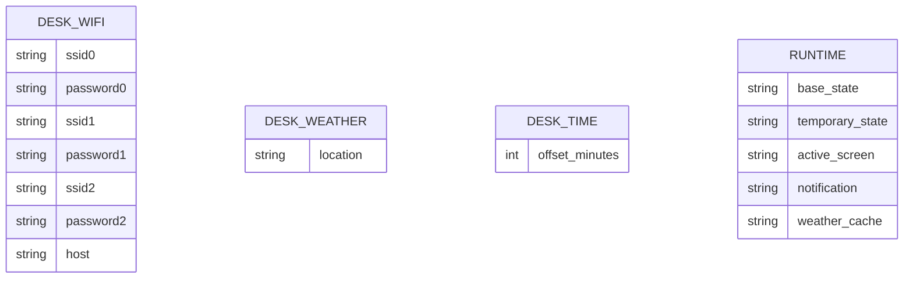

# DeskBuddy firmware logic

This document describes the firmware as it exists in `deskbuddy/`. It is the implementation guide for extending the device without reintroducing the removed behavior engines.

## 1. Responsibilities and boundaries

DeskBuddy has six small responsibilities:

1. Render a 128×64 monochrome OLED using Adafruit SSD1306 and FluxGarage RoboEyes.
2. Maintain a runtime display state: base animation, temporary animation, active screen, and one notification.
3. Manage Wi-Fi station connection, a private three-entry credential history, reconnects, mDNS, and captive pairing mode.
4. Maintain a cached Open-Meteo weather value and an NTP clock.
5. Serve the embedded Web UI and JSON REST API.
6. Persist only network credentials, weather location, clock offset, and hostname.

There is deliberately no mood engine, personality model, memory system, sensor subsystem, task queue, arbitrary graphics upload, or authentication layer.

## 2. Source organization

| File | Ownership |
|---|---|
| `deskbuddy.ino` | Global objects, setup order, cooperative loop, boot log |
| `config.h` | Board profiles, pins, timing limits, names, API limits |
| `clock.*` | Persisted UTC offset and NTP configuration |
| `state.*` | Runtime animation/screen/notification state and expiry |
| `animations.*` | RoboEyes instance, presets, and automatic playlist |
| `ui_toolkit.*` | Frame primitives, cards, text, and notification glyphs |
| `screens.*` | Clock, weather, notification, Wi-Fi, setup, error, and face rendering |
| `network.*` | Preferences history, station/AP state, captive DNS, mDNS, Web UI |
| `weather.*` | Open-Meteo URL, HTTPS request, cache, and parsing |
| `api.*` | HTTP route registration, hand-rolled JSON parsing, responses |

The Arduino project has one RoboEyes include site (`animations.cpp`) so the library's global definitions do not create multiple-definition linker errors across translation units.

## 3. Boot sequence

`setup()` runs these phases in order:

1. Start Serial at 115200 baud.
2. Start I²C on the selected board pins at 400 kHz.
3. Initialize the SSD1306 display.
4. Initialize RoboEyes and the UI toolkit.
5. Initialize runtime state.
6. Load weather location.
7. Load the UTC offset.
8. Load Wi-Fi history and start station or pairing mode.
9. Register API routes.
10. Start the HTTP server.
11. Clear the boot framebuffer so the next loop owns the OLED frame.

The OLED displays a Linux-style rolling boot log during the sequence. Boot status messages do not alter the initialization order.



## 4. Cooperative loop

The main loop is intentionally single-threaded and timer-driven:

```cpp
service HTTP/DNS
update Wi-Fi
update weather
expire runtime state
render one OLED frame when due
delay(1)
```

Detailed order:

1. `DeskBuddyNetwork::service()` processes captive DNS and HTTP clients.
2. `DeskBuddyNetwork::update()` advances Wi-Fi, mDNS, and NTP startup.
3. `DeskBuddyWeather::update()` performs a weather request if forced or due.
4. `DeskBuddyState::update()` expires temporary state and notifications.
5. `DeskBuddyScreens::update()` renders a frame when the 83 ms frame gate allows it.
6. The loop yields for 1 ms.

The weather HTTPS `GET` is synchronous and can block this loop for up to the configured 4-second HTTP timeout. The API route `/api/weather/refresh` does not perform the request itself; it sets a flag and returns `{"status":"scheduled"}`. The actual request occurs later in the loop.



## 5. Runtime state and ownership

`state.cpp` owns these runtime values:

- `baseStateName`, initially `cheerful`
- `temporaryStateName` and `temporaryUntilMs`
- `screenName`, initially `face`
- one `Notification` object and `notificationActive`

The base animation is **not persistent**. It resets to `cheerful` on reboot. The `/api/state/base` route changes it only for the current runtime.

Supported animations:

```text
cheerful, blink, curious, happy, sleepy, surprised, celebrate
```

The automatic playlist only cycles these five every 18 seconds:

```text
cheerful, curious, happy, sleepy, surprised
```

`blink` and `celebrate` are API-selectable but are not automatic playlist entries.

Supported screens:

```text
face, clock, weather, notification, wifi, setup, error
```

A temporary state, screen, or notification uses one shared expiry timestamp. A later request overwrites the active screen/state rather than entering a queue. When the timestamp expires, the firmware clears the temporary state and notification and returns to `face`. A `face` screen request intentionally has no expiry.



## 6. Rendering and frame ownership

`DeskBuddyScreens::update()` owns the application-level frame decision.

- Static screens clear the shared framebuffer before drawing.
- Static screens call `display.display()` after drawing.
- RoboEyes owns face drawing and clears/flushes its own face frame.
- Frames are rate-limited to approximately 12 FPS by `DESKBUDDY_OLED_FRAME_MS`.
- The full SSD1306 framebuffer is about 1 KB.



The notification body is currently rendered as two 16-character slices. Longer body text is stored with a 180-character limit but is not fully paginated.

## 7. Wi-Fi state machine

The `desk_wifi` Preferences namespace stores:

```text
ssid0, password0
ssid1, password1
ssid2, password2
host
```

Legacy `ssid`/`password` keys are migrated when no new history exists. The list is private and never included in API responses.

On each boot, the newest entry is attempted first. Each entry receives the configured 20-second timeout. If it fails, the next entry is attempted. Once all entries fail, the open `DeskBuddy-Setup-*` AP starts at `192.168.4.1` with wildcard captive DNS.

Submitting `/save` inserts the new credential at index zero, removes duplicates, shifts older entries, and drops the fourth/oldest entry. The HTTP response is sent before the AP is disconnected; station reconnection begins approximately 500 ms later.



The AP is open because `DESKBUDDY_SETUP_AP_PASSWORD` is empty. The local API is also unauthenticated. Both are suitable only for a trusted environment.

## 8. Clock lifecycle

`clock.cpp` stores `utc_offset_minutes` in the `desk_time` namespace. The allowed range is −720 to +840 minutes. On the first successful station connection, NTP is configured with:

```text
pool.ntp.org
 time.nist.gov
 time.google.com
```

The offset is applied as the `configTime` GMT offset. The clock screen shows local 24-hour time (`%H:%M`) and date (`%a %d %b`). Until NTP supplies a valid time, it displays `Waiting for NTP`.

NTP configuration starts once per boot after connection. Changing the offset through the API or Web UI persists it and reconfigures NTP immediately.

## 9. Weather lifecycle

`weather.cpp` stores the raw `latitude,longitude` string in the `desk_weather` namespace. The Web UI expects a value such as:

```text
45.52,-122.67
```

At refresh time the values are trimmed, converted to floats, and validated against latitude/longitude ranges. Open-Meteo is called over HTTPS with `WiFiClientSecure::setInsecure()`, so certificate verification is intentionally disabled.

The firmware requests current temperature, WMO weather code, precipitation amount, wind speed, and the first hourly precipitation probability. The cached API summary is formatted approximately as:

```text
18.0°C · Cloudy · Rain 20% · Wind 12 km/h
```

The OLED weather screen shows the weather icon, temperature, condition, rain probability/amount, and wind speed. Clock screens show a clock glyph and larger time typography. Wi-Fi, pairing, and error screens use their corresponding status glyphs. Weather availability is runtime-only and resets after reboot or Wi-Fi loss. A refresh is requested immediately during boot; the request waits until Wi-Fi is connected and then populates the first cache. A refresh request from the API is asynchronous. The Web UI and API should be used to configure the location before refreshing.

## 10. API routing and event ownership

Routes are registered by `api.cpp` on the shared `WebServer` owned by `network.cpp`.



The API parser is a small substring parser, not a complete JSON implementation. Clients should send compact, simple JSON and treat HTTP 400 responses as authoritative.

## 11. Persistence map



Runtime state is intentionally not persisted. This keeps boot behavior deterministic and avoids unnecessary NVS wear.

## 12. Extension rules

When adding a feature:

1. Keep the feature owned by one module.
2. Add a bounded state representation.
3. Add an explicit timer or event boundary.
4. Do not perform long work from an HTTP callback.
5. Avoid unbounded `String` growth and queues.
6. Keep static screens responsible for clearing their own frame.
7. Add the route, Python method, tests, and documentation together.
8. Do not expose stored Wi-Fi passwords.
9. Preserve C3 memory and OLED frame-time budgets.
